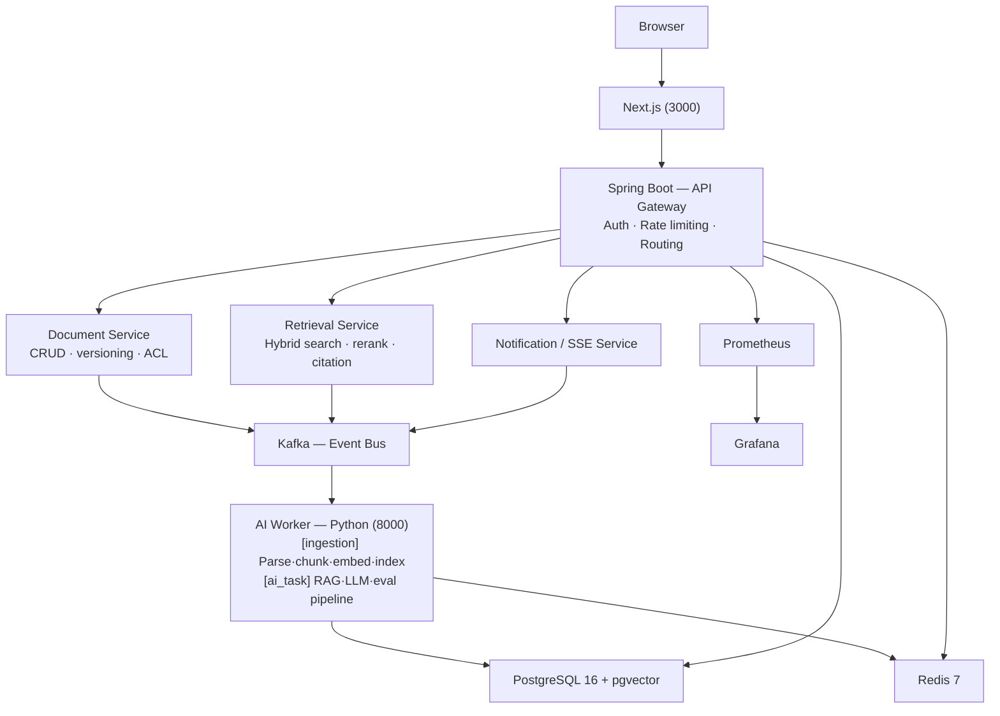

# DevPulse

A distributed AI developer Q&A platform. Upload technical documents or import Stack Overflow data; get precise answers powered by Hybrid RAG (BM25 + pgvector) + Claude `claude-sonnet-4-6` with streaming responses, circuit breaker fallback, and full observability.

## Architecture



## Quick Start (5 minutes)

```bash
git clone https://github.com/your-username/devpulse
cd devpulse
cp .env.example .env
# Edit .env — fill in ANTHROPIC_API_KEY, JWT_PRIVATE_KEY, JWT_PUBLIC_KEY

# 1. Start infrastructure
docker compose -f infra/docker-compose.dev.yml up -d

# 2. Start backend (Java 21 + Gradle required)
cd backend && ./gradlew bootRun

# 3. Start AI Worker (Python 3.11 required)
cd ai-worker
pip install -r requirements.txt
uvicorn app.main:app --reload --port 8000

# 4. Start frontend (Node 20 required)
cd frontend
npm install
npm run dev

# Open http://localhost:3000
```

## Full Stack via Docker

```bash
# All .env values must be filled in first
docker compose -f infra/docker-compose.yml up -d
```

## Data Import

```bash
# Download Stack Overflow data dump: https://archive.org/details/stackexchange
# Extract Posts.xml (~20GB uncompressed), then:
python scripts/seed_data.py \
  --workspace-id <your-workspace-id> \
  --input /path/to/Posts.xml \
  --limit 50000 \
  --api-url http://localhost:8080 \
  --token <your-jwt-token>
# Use --resume to continue an interrupted import
```

## Run Evaluation

```bash
python scripts/run_eval.py \
  --workspace-id <your-workspace-id> \
  --samples 500 \
  --api-url http://localhost:8080 \
  --token <your-jwt-token>
# Outputs relevance score, hit rate, latency P50/P95/P99, and estimated cost
```

## Monitoring

| Service | URL |
|---------|-----|
| App | http://localhost:3000 |
| Backend API | http://localhost:8080 |
| Kafka UI | http://localhost:8090 |
| Prometheus | http://localhost:9090 |
| Grafana | http://localhost:3001 (admin / admin) |
