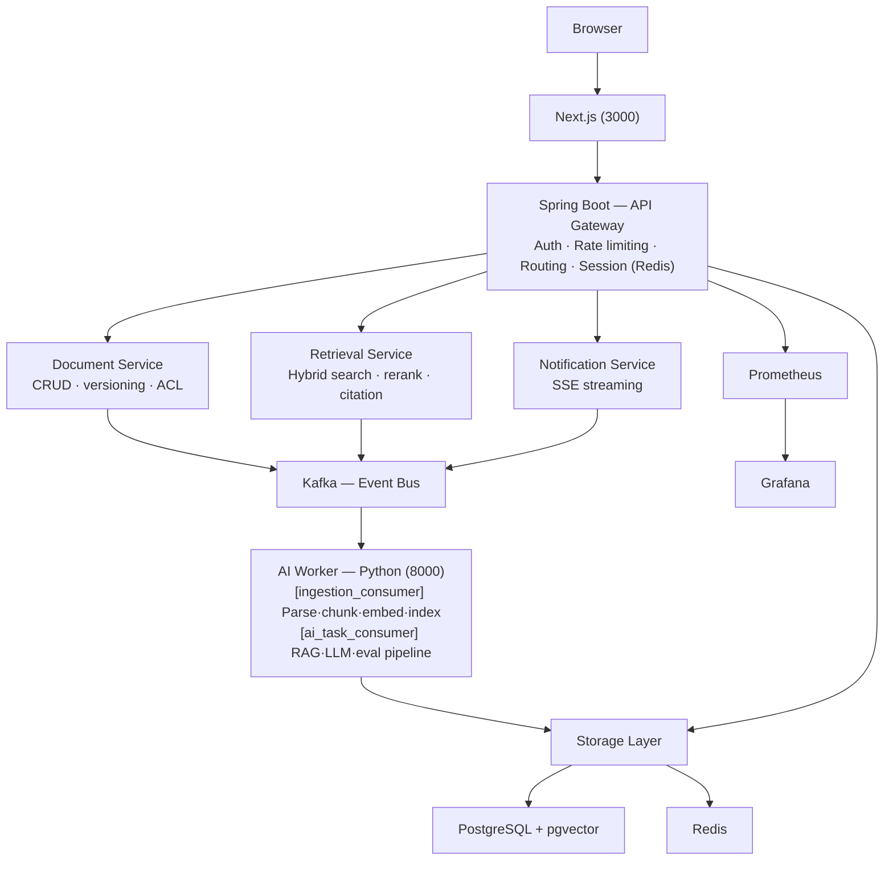

# DevPulse — System Design Document

**Date**: 2026-04-04  
**Status**: Approved  
**Build Strategy**: Approach A — Sequential sub-projects (Infra → Backend → AI Worker → Frontend → Scripts → CI/CD)

## Git Workflow Rules

- Commit after each feature point is implemented (fine-grained commits)
- Commit messages must NOT include `Co-Authored-By` or any Claude attribution
- Only the user appears as contributor — no AI co-author lines

---

## 1. Project Overview

DevPulse is a distributed AI developer Q&A platform. Developers upload technical documents or import Stack Overflow data; the platform answers questions using Hybrid RAG retrieval + Claude AI with async indexing, streaming responses, circuit breaker fallback, session persistence, and full observability.

**Purpose**: Production-grade resume showcase demonstrating distributed systems design, GenAI integration, and end-to-end engineering.

---

## 2. Architecture



**Tech Stack**:
- Frontend: Next.js 14 (App Router) + Tailwind CSS + shadcn/ui
- Backend: Spring Boot 3.2 (Java 21) + Gradle
- AI Worker: Python 3.11 + FastAPI
- Database: PostgreSQL 16 + pgvector
- Cache/Queue: Redis 7
- Message Queue: Apache Kafka
- Deploy: Docker Compose (dev) + Kubernetes (prod)
- Monitoring: Prometheus + Grafana
- CI/CD: GitHub Actions

---

## 3. Sub-Project Breakdown

| # | Sub-Project | Key Deliverables |
|---|-------------|-----------------|
| 1 | Infra | docker-compose files, Flyway schema, K8s manifests, Prometheus/Grafana |
| 2 | Backend | Spring Boot API, JWT auth, Kafka producer/consumer, Circuit Breaker, Metrics |
| 3 | AI Worker | FastAPI, ingestion pipeline, BM25 3-layer cache, Hybrid RAG, Claude streaming |
| 4 | Frontend | Next.js app, SSE streaming chat, session history, futuristic dark UI |
| 5 | Scripts | seed_data.py (SO import), run_eval.py (RAG evaluation) |
| 6 | CI/CD | GitHub Actions 5-job pipeline, K8s rolling deploy with auto-rollback |

---

## 4. Infrastructure Design

### 4.1 Docker Compose

**`infra/docker-compose.dev.yml`** — infrastructure only:
- `postgres:16` on port 5432, initializes `vector` and `pg_trgm` extensions
- `redis:7-alpine` on port 6379, AOF persistence enabled
- `confluentinc/cp-zookeeper:7.5.0` on port 2181
- `confluentinc/cp-kafka:7.5.0` on ports 9092/29092
  - Pre-creates 5 topics: `document-ingestion` (3p/1r), `ai-tasks` (3p/1r), `task-status` (3p/1r), `document-ingestion-dlq` (1p/1r), `ai-tasks-dlq` (1p/1r)
  - `KAFKA_AUTO_CREATE_TOPICS_ENABLE=false`
- `provectuslabs/kafka-ui:latest` on port 8090

**`infra/docker-compose.yml`** — full stack (extends dev):
- `backend` on port 8080, healthcheck: `GET /actuator/health`
- `ai-worker` on port 8000, healthcheck: `GET /health`
- `frontend` on port 3000
- `prometheus` on port 9090
- `grafana` on port 3001, auto-loads dashboard JSON

### 4.2 Database Schema (Flyway)

**V1__init.sql**:
```sql
users(id, email, password_hash, display_name, role, created_at)
workspaces(id, name, owner_id, created_at)
documents(id, workspace_id, title, content, source_type, source_url, status, chunk_count, error_message, created_at, indexed_at)
chat_sessions(id, workspace_id, user_id, title, created_at, updated_at)
messages(id, session_id, role, content, sources JSONB, tokens_used, latency_ms, created_at)
  INDEX: idx_messages_session_id ON messages(session_id, created_at)
tasks(id, type, payload JSONB, status, error_message, retry_count, created_at, updated_at)
```

**V2__pgvector.sql**:
```sql
document_chunks(id, document_id, workspace_id, chunk_index, content, metadata JSONB, embedding vector(384), created_at)
  INDEX: IVFFlat on embedding (cosine, lists=100)
  INDEX: idx_chunks_workspace, idx_chunks_document
  INDEX: idx_chunks_content_trgm (gin_trgm_ops) for BM25 fallback
bm25_indexes(id, workspace_id UNIQUE, index_data BYTEA, document_count, updated_at)
```

### 4.3 Kubernetes (`infra/k8s/`)

- `namespace.yaml`: namespace `devpulse`
- `configmap.yaml`: non-sensitive config (Kafka, Postgres, Redis hosts, log level)
- `secret.yaml`: ANTHROPIC_API_KEY, POSTGRES_PASSWORD, JWT keys (base64 placeholders)
- Backend: Deployment (replicas:2) + HPA (2-5, CPU 70%) + Service
- AI Worker: Deployment (replicas:2) + Service
- Frontend: Deployment (replicas:2) + Service
- Ingress: Nginx, `/api/*` → backend, `/*` → frontend, TLS via cert-manager

### 4.4 Monitoring

- `infra/monitoring/prometheus.yml`: scrapes backend:8080 and ai-worker:8000
- `infra/monitoring/dashboards/devpulse.json`: 5 dashboard rows:
  - Row 1: API rate, error rate, active SSE connections, circuit breaker state
  - Row 2: API P50/P95/P99 latency, retrieval method comparison, LLM latency histogram
  - Row 3: Kafka consumer lag, message rates, DLQ count
  - Row 4: Token usage, estimated cost, guardrail blocks, BM25 cache hit rate
  - Row 5: Document index success/fail, hourly chunks, indexing latency

---

## 5. Backend Design (Spring Boot 3.2 / Java 21)

### 5.1 Authentication

- JWT RS256 (asymmetric): access token 15min, refresh token 7 days
- Logout: writes token `jti` to Redis blacklist (TTL = token remaining lifetime)
- Spring Security: whitelist `/api/auth/**`, `/actuator/**`; all others require auth

### 5.2 API Endpoints (25 total)

```
POST   /api/auth/register
POST   /api/auth/login
POST   /api/auth/refresh
DELETE /api/auth/logout

GET/POST       /api/workspaces
GET/DELETE     /api/workspaces/{id}

GET            /api/workspaces/{wId}/documents
POST           /api/workspaces/{wId}/documents/upload       (multipart → Kafka)
POST           /api/workspaces/{wId}/documents/import-so
GET/DELETE     /api/workspaces/{wId}/documents/{id}

GET/POST       /api/workspaces/{wId}/sessions
GET/DELETE     /api/workspaces/{wId}/sessions/{id}
GET            /api/workspaces/{wId}/sessions/{id}/messages
POST           /api/workspaces/{wId}/sessions/{id}/messages (→ Kafka, returns task_id)
GET            /api/workspaces/{wId}/sessions/{id}/stream   (SSE)

GET            /api/tasks/{taskId}
GET            /actuator/prometheus
GET            /actuator/health
```

### 5.3 Kafka Events

```java
// Produced by Backend:
DocumentIngestionEvent(documentId, workspaceId, sourceType, contentOrPath, metadata, createdAt)
AiTaskEvent(taskId, sessionId, workspaceId, userMessage, conversationHistory[10], createdAt)

// Consumed by Backend (from AI Worker):
TaskStatusEvent(taskId, sessionId, status, chunk, isDone, fullResponse, sources, tokensUsed, latencyMs, errorMessage)
```

### 5.4 Session History Persistence

1. POST /messages: user message → written immediately to `messages` table
2. Load last 10 messages from DB → pack into `AiTaskEvent.conversationHistory`
3. Publish to `ai-tasks` → return `task_id`
4. On `TaskStatusEvent(done)`: write assistant message to `messages` table with sources/tokens/latency
5. GET /messages: read full history from PostgreSQL (no cache), sorted by `created_at ASC`

### 5.5 Circuit Breaker (Resilience4j)

```yaml
resilience4j:
  circuitbreaker.instances.aiWorker:
    slidingWindowSize: 10
    minimumNumberOfCalls: 5
    failureRateThreshold: 50
    slowCallRateThreshold: 80
    slowCallDurationThreshold: 10s
    waitDurationInOpenState: 30s
  retry.instances.aiWorker:
    maxAttempts: 3
    waitDuration: 1s
    exponentialBackoffMultiplier: 2
```

Fallback: check Redis for cached answer → return cached (labeled "(cached response)") or degradation message. User message always persisted.

### 5.6 Redis Cache Strategy (managed by `RedisService`)

| Key Pattern | TTL | Purpose |
|-------------|-----|---------|
| `user:{userId}` | 5min | User info |
| `ws:{workspaceId}` | 10min | Workspace metadata |
| `docs:{workspaceId}` | 2min | Document list (invalidated on write) |
| `rl:{userId}:{minute}` | 60s | Rate limiting counter |
| `token:blacklist:{jti}` | token lifetime | JWT blacklist |
| `task:{taskId}` | 1h | Task status (frontend polling) |
| `ai:cache:{workspaceId}:{hash}` | 30min | AI answer cache (circuit breaker fallback) |
| `stream:{sessionId}` | Pub/Sub | SSE streaming channel |
| `bm25:lock:{workspaceId}` | 60s | BM25 rebuild distributed lock |

### 5.7 Rate Limiting

Bucket4j + Redis: `POST /api/*/sessions/*/messages` → 10 requests/user/minute → 429 + `Retry-After` header on exceed.

### 5.8 Prometheus Metrics (Backend)

```
devpulse_api_request_total{method, endpoint, status}           Counter
devpulse_api_latency_seconds{endpoint}                         Histogram (0.05,0.1,0.3,1,3,10)
devpulse_kafka_messages_produced_total{topic}                  Counter
devpulse_kafka_messages_consumed_total{topic, status}          Counter
devpulse_cache_hit_total{key_type}                             Counter
devpulse_cache_miss_total{key_type}                            Counter
devpulse_active_sse_connections                                Gauge
devpulse_circuit_breaker_state{name}                           Gauge (0=closed,1=open,2=half_open)
devpulse_circuit_breaker_fallback_total{reason}                Counter
devpulse_rate_limit_exceeded_total                             Counter
```

### 5.9 Idempotent Kafka Consumption

- Check Redis `task:{taskId}` status before processing (skip if already DONE/FAILED)
- Lock with `processing:task:{taskId}` (SET NX, TTL 30s)
- Release lock after processing

---

## 6. AI Worker Design (Python 3.11 / FastAPI)

### 6.1 Project Structure

```
ai-worker/
├── app/
│   ├── main.py
│   ├── config.py
│   ├── consumers/
│   │   ├── ingestion_consumer.py
│   │   └── ai_task_consumer.py
│   ├── services/
│   │   ├── embedding_service.py     # all-MiniLM-L6-v2 singleton, batch=32
│   │   ├── retrieval_service.py     # hybrid search + RRF
│   │   ├── llm_service.py           # Claude API streaming + guardrails
│   │   ├── ingestion_service.py     # chunking + embedding + DB write
│   │   └── bm25_service.py          # 3-layer cache management
│   ├── models/schemas.py
│   └── utils/chunker.py
├── tests/
├── requirements.txt
└── Dockerfile
```

### 6.2 Ingestion Pipeline

1. Extract text: PDF (pypdf, preserve page numbers) / Markdown (split by ##) / plain text
2. Chunk: 300-400 words, paragraph-preserving, 50-word overlap, metadata retained
3. Embed: all-MiniLM-L6-v2 (384-dim), batch size 32, model pre-loaded as singleton
4. Batch write to `document_chunks` (batch size 100)
5. Rebuild BM25 index → persist to 3 layers
6. Update `documents`: status=INDEXED, chunk_count, indexed_at
7. Publish `TaskStatusEvent(done)` to `task-status`

Error handling: tenacity exponential backoff (3 retries, initial 1s, multiplier 2). On final failure: documents.status=FAILED, send to DLQ.

### 6.3 BM25 Three-Layer Cache

**Priority order**: Memory dict → Redis (pickle, TTL 24h) → PostgreSQL `bm25_indexes`

**Write**: after every successful ingestion → rebuild → write all 3 layers simultaneously. Distributed lock (`bm25:lock:{workspaceId}`, TTL 60s) prevents concurrent rebuilds.

**Read**: memory hit → return immediately; miss → deserialize from Redis; miss → load from PostgreSQL + write back to Redis; miss → full rebuild from `document_chunks`.

**Startup**: FastAPI startup event iterates `bm25_indexes` table → deserialize all → populate memory cache. Log: `Restored BM25 indexes for N workspaces`.

### 6.4 Hybrid Retrieval (RRF)

```
Step 1: Vector search — embed query → cosine similarity → top_k×4 candidates
Step 2: BM25 search — tokenize query → get_scores → top_k×4 candidates
Step 3: Union candidates (deduplicate)
Step 4: RRF fusion (k=60):
         rrf_score = 1/(k + rank_vector) + 1/(k + rank_bm25)
Step 5: Sort by rrf_score DESC → return top_k=5
```

Fallback: if BM25 index unavailable → return vector-only results + log warning.

### 6.5 Claude API Streaming + RAG Prompt

**Model**: `claude-sonnet-4-6`, max_tokens 1024

**System prompt**:
> You are a precise technical Q&A assistant for developers. Answer questions based ONLY on the provided context. Always cite sources using [source_1], [source_2] notation. If the context is insufficient, clearly state what information is missing. Be concise and accurate. Prefer code examples when relevant.

**User message**: up to 5 chunks (≤3000 tokens total) + last 10 conversation history messages + current question

**Streaming**: each text token → publish `TaskStatusEvent(status=streaming, chunk=token)` → on finish publish `TaskStatusEvent(status=done, fullResponse, sources, tokensUsed, latencyMs)`

### 6.6 AI Guardrails

**Input**:
- Length: reject if query > 2000 chars → return 400
- Prompt injection: regex match for `ignore previous instructions`, `ignore all instructions`, `you are now`, `act as`, `jailbreak`, `DAN` → return degradation message, log warning, record `devpulse_guardrail_blocked_total`

**Output**:
- Scan for `sk-ant-...` pattern → replace with `[REDACTED]`

### 6.7 Prometheus Metrics (AI Worker)

```
devpulse_ingestion_documents_total{status}        Counter (indexed/failed)
devpulse_ingestion_chunks_total                   Counter
devpulse_ingestion_latency_seconds                Histogram
devpulse_retrieval_latency_seconds{method}        Histogram (vector/bm25/hybrid/rrf)
devpulse_retrieval_top_score                      Histogram (RRF top score distribution)
devpulse_llm_tokens_total{type}                   Counter (prompt/completion)
devpulse_llm_latency_seconds                      Histogram
devpulse_llm_cost_usd_total                       Counter (estimated by claude-sonnet-4-6 pricing)
devpulse_guardrail_blocked_total{reason}          Counter
devpulse_bm25_cache_hit_total{layer}              Counter (memory/redis/postgres/rebuild)
devpulse_kafka_consumer_lag{topic,partition}      Gauge
```

Endpoints: `GET /metrics` (prometheus_client format), `GET /health` returns `{"status":"ok","bm25_indexes_loaded":N}`

### 6.8 Idempotent Kafka Consumption

- `enable_auto_commit=False`, manual commit after each successful processing
- Redis SET NX check: `processed:event:{eventId}` (TTL 1h) to detect duplicates
- Distributed lock: `processing:event:{eventId}` (SET NX) before processing

---

## 7. Frontend Design (Next.js 14 / App Router)

### 7.1 Routes

```
/                                    → redirect to /login or /dashboard
/login                               → login page
/register                            → register page
/dashboard                           → workspace list
/workspace/[id]                      → document manager + session list
/workspace/[id]/chat/[sessionId]     → chat interface
```

### 7.2 Design Language

- Background: `#0a0a0f` deep black
- Accent: cyan-400 / violet-500 gradient
- Cards: backdrop-blur + low-opacity border (frosted glass)
- Glow effects on hover/active states
- Typography: Geist (body) + JetBrains Mono (code blocks)
- Reference aesthetic: Cursor / GitHub Copilot / Vercel AI SDK UI

### 7.3 ChatInterface (3-column layout)

**Left (240px)** — Session list:
- Load from `GET /sessions`, sorted by `updated_at DESC`
- Show: truncated title + relative timestamp
- Click → update URL, load history

**Center (flex-1)** — Message stream:
- On load: fetch full history from `GET /sessions/{id}/messages` (session persistence)
- Markdown rendering: react-markdown + remark-gfm
- Code highlighting: react-syntax-highlighter (dark theme)
- Streaming: character-by-character append + blinking cursor animation
- Each assistant message footer: token count + latency
- Drag-and-drop document upload directly in chat

**Right (280px, collapsible)** — Sources panel:
- Shows chunks cited in current AI answer
- Per source: title, relevance score, 150-char summary
- Click to expand full content

**Bottom input**:
- Textarea: Enter to send, Shift+Enter for newline
- Disabled + "AI is thinking..." during streaming
- Error state with retry button

### 7.4 useStreamingMessage Hook

1. POST /messages → get `task_id`
2. Open SSE: `GET /sessions/{id}/stream?taskId={task_id}`
3. `onmessage`: parse chunk → append to current assistant message
4. `onmessage` (isDone=true): close SSE, update Sources panel
5. `onerror`: set error state, show retry button
6. Component unmount: close SSE connection

### 7.5 DocumentManager

- Document list: title, status badge (PENDING=gray, PROCESSING=blue+animate, INDEXED=green, FAILED=red), chunk_count, indexed_at
- Drag-and-drop upload zone: PDF/MD/TXT, upload progress indicator
- Post-upload: poll `GET /tasks/{taskId}` every 2s until INDEXED/FAILED
- FAILED: show error_message, provide re-trigger button

### 7.6 API Client (`lib/api/`)

- axios instance, `NEXT_PUBLIC_API_BASE_URL` from env
- Request interceptor: inject `Authorization: Bearer {token}`
- Response interceptor: 401 → call `POST /auth/refresh` → retry original request. Refresh failure → clear tokens → redirect `/login`
- Full TypeScript types for all endpoints

---

## 8. Scripts

### 8.1 seed_data.py

- Input: Stack Overflow Posts.xml (SAX parser, memory-efficient)
- Filter: PostTypeId=1 (Question) + AcceptedAnswerId + Tags∈{python,java} + Score≥5, max 50,000 records
- Output: document = `{title}\n\n{question_body}\n\n---\nAccepted Answer:\n{answer_body}`
- Metadata: question_id, score, view_count, tags, answer_count, creation_date
- Batch POST to `/api/workspaces/{id}/documents/import-so` (batch size 100)
- Resume: `.seed_progress.json` tracks processed question IDs, `--resume` flag to skip processed
- Progress: tqdm bar + final stats (success/fail/skip counts)

### 8.2 run_eval.py

- Sample 500 Q&A pairs from imported SO data
- Test 3 strategies: `no_rag` / `vector_only` / `hybrid`
- Metrics:
  - Answer Relevance (0-10): scored by Claude
  - Context Hit Rate: TF-IDF similarity > 0.3 between retrieved chunks and ground truth
  - Latency: P50/P95/P99 per strategy
  - Token cost: estimated by claude-sonnet-4-6 pricing
- Output: tabulate summary table to terminal + full `eval_results_{timestamp}.json`

---

## 9. CI/CD (GitHub Actions)

**Trigger**: push to `main`, PR to `main`

| Job | Runs When | Steps |
|-----|-----------|-------|
| `test-backend` | always | Java 21 + PG service + Gradle test + Jacoco |
| `test-ai-worker` | always | Python 3.11 + PG/Redis services + pytest + coverage |
| `test-frontend` | always | Node 20 + pnpm lint + type-check + build |
| `build-and-push` | main only, after tests | Docker buildx (amd64/arm64) → ghcr.io with SHA tag + latest |
| `deploy` | main only, after build | kubectl set image → rollout status → auto rollout undo on failure |

**Multi-stage Dockerfiles** (all 3 services): layer caching, minimal runtime images. AI Worker pre-downloads sentence-transformers model at build time.

---

## 10. Testing Requirements

Coverage target: >60% core business logic per service.

**Backend tests** (`src/test/`):
- `AuthServiceTest`: register, login, token refresh, logout blacklist
- `MessageServiceTest`: send message, history load, circuit breaker trigger
- `DocumentServiceTest`: upload, status polling, Kafka event publish
- `HybridRetrievalIntegrationTest`: Testcontainers PostgreSQL

**AI Worker tests** (`tests/`):
- `test_ingestion_service.py`: chunking logic, embedding batching
- `test_retrieval_service.py`: hybrid search, RRF score calculation
- `test_bm25_service.py`: 3-layer cache hit/persist/restore
- `test_guardrails.py`: prompt injection detection, output filtering

**Frontend tests** (`tests/`, optional but recommended):
- `ChatInterface.test.tsx`: SSE streaming render, history load
- `useStreamingMessage.test.ts`: hook state management

---

## 11. Environment Variables

See `.env.example` for full list. Key variables:

| Variable | Service | Notes |
|----------|---------|-------|
| `ANTHROPIC_API_KEY` | AI Worker | `sk-ant-...` |
| `JWT_PRIVATE_KEY` | Backend | RS256 PEM |
| `JWT_PUBLIC_KEY` | Backend | RS256 PEM |
| `SPRING_DATASOURCE_URL` | Backend | PostgreSQL JDBC URL |
| `DATABASE_URL` | AI Worker | PostgreSQL URL |
| `KAFKA_BOOTSTRAP_SERVERS` | Both | `localhost:9092` |
| `EMBEDDING_MODEL` | AI Worker | `all-MiniLM-L6-v2` |
| `NEXT_PUBLIC_API_BASE_URL` | Frontend | Backend URL |

---

## 12. Key Architecture Decisions

**ADR-001: pgvector over Pinecone** — keeps everything in one database, eliminates external dependency, simpler ops, sufficient for this scale.

**ADR-002: Kafka over direct HTTP** — decouples AI Worker from Backend, enables retry/DLQ, allows AI Worker to scale independently, prevents request timeouts for long ingestion jobs.

**ADR-003: Hybrid Retrieval (BM25 + vector + RRF)** — vector search excels at semantic similarity; BM25 excels at exact keyword match (e.g., function names, error codes). RRF fusion captures both without tuning weights.

**ADR-004: BM25 3-layer cache** — memory (fastest) → Redis (cross-process, survives restarts) → PostgreSQL (survives Redis failure). Prevents rebuild on every query; distributed lock prevents thundering herd on rebuild.

**ADR-005: Circuit Breaker fallback design** — cached answer > degradation message. User messages always persisted regardless of AI Worker state, ensuring no data loss during outages.
